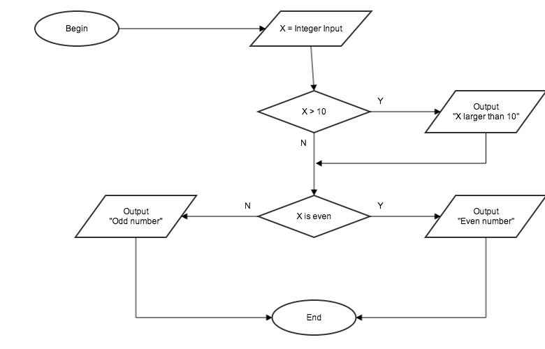

# Lesson 2: Decision Making

## 2.1 Flowcharts
Forget about programming for a second and think about a car. When a group of engineers design a car, they have a high-level blueprint for the whole car. This blueprint refers to many other blueprints which capture the details of the smaller working parts such as the engine, the steering wheels, and so on.

For computer programs, their "blueprints" can be represented by flowcharts. Larger programs will have many flowcharts, and smaller programs will have fewer flowcharts. Flowcharts capture the ideas behind a program and how it executes.

> In reality, flowcharts aren't used as often as one might think. Seasoned programmer can form ideas in their heads and start coding. However, it is important to get into the habit of thinking in terms of how a program executes.

### 2.1.1 The beginning and The end
Every program has a beginning and an end – as do flowcharts. A complete flowchart often start with the word **"Begin"** inside an oval shape and ends with the word **"End"** inside another oval shape. To a program which does absolutely nothing, the flowchart would look like this:

Notice that an arrow is used to guide the direction of which the program is executing.

> There aren't hard-golden rules to the shape of different pieces inside a flowchart. However, there are conventions that most people follow. You might occasionally see flowcharts that start with circles instead of ovals. Same goes for the other shapes in the rest of this lesson.

### 2.1.2 Input and Output (I/O)
In lesson one, you have written programs which output to the console window and take user input. Within a flowchart, **parallelograms** (or slanted rectangles) are often used to represent I/O operations.

Example of an output parallelogram:

Example of an input parallelogram:

Example of a program which prints out "Hello world!" to the console:

In this case, even though the program outputs to the console window, the flowchart didn't get into the specifics. Flowcharts capture ideas which can be implemented in different programming languages and systems. However, there are cases where it is necessary to get specific, such as differentiating between writing to the console window and writing to a file, in the same program.

### 2.1.3 Actions
Rectangles are used to describe actions which don't interact with users (not I/O). 

Example of an action which increments the value `X` by 1:

Inside a complete program:

### 2.1.4 Conditions
So far, all the programs we have written or designed just follow one straight path from the beginning to the end. Most programs are more complicated than that – they often have to decide if one action should be taken rather than another. To know which actions should be taken, a program would evaluate if some condition is satisfied. 

In the world of flowcharts, conditions are usually represented by a diamond shape, with two arrows pointing out. One arrow is annotated with a **"Yes"** or **"Y"**. The other arrow is annotated with a **"No"** or **"N"**. The program will go with the "Yes" path if the condition inside the diamond is satisfied. Respectively, it will go with the "No" path if the condition is not satisfied.

The following example represents a condition which the value of `X` is less than 5:

Inside the context of a program:

This program asks the user for an integer number. Based on whether the number is less than 5 or greater than 5, it will print out an appropriate message.

### 2.1.5 Example

Let's suppose we want to design a program which will **have the user input an integer. If the number is higher than 10 then print the message "This number is larger than 10". Either way, let the user know if the number is odd or even.**

Let's interpret this chart:

1. The program begins 
2. The user is asked for an integer `X`. 
3. Then the program checks if `X` is greater than `10`. If it's true then the program prints a message. Because we are going to the next part of the program either way, the `Output "X larger than 10"` (from the "Yes" path) points back to the "No" path. 
4. The program checks if `X` is an even number, then print out the corresponding message.
6. The program ends.

## 2.2 Exercises
For each the problems below, design a complete flowchart for the program.

### 2.2.1 Weekday
Have the user enter an integer, and print out the corresponding weekday:

* 1 for Sunday
* 2 for Monday
* . . .
* 6 for Friday
* 7 for Saturday

If the number is outside that range (1 to 7) then print out an error message.

### 2.2.2 FizzBuzz
Have the user enter an integer.

* If the number is divisible by 3 then print out `Fizz` (inside the diamond just say "Divisible by 3").
* If the number is divisible by 5 then print out `Buzz`.
* If the number is divisible by both 3 and 5 then print out `FizzBuzz`.

### 2.2.3 Cashier
This program will simulate a simple cashier. The cashier will ask user for the bill total, and the amount that the customer has paid (for learning purpose, use integer input – the cashier will enter the amount in pennies).

* If the customer paid the exact amount then print out "Customer paid exact amount."*
* If the customer paid more than the bill then print out the amount that we owe the customer (e.g. "We owe the customer 135 cents.")
* If the customer paid less than the bill then print out the addition amount the customer owes (e.g. "The customer needs to pay 25 cents more.")

### 2.2.4 Largest of three
This program will ask the user for 3 integers `X`, `Y`, and `Z`, then the program will print out the largest out of those 3 numbers.
