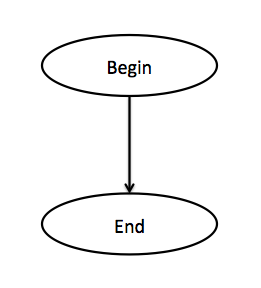
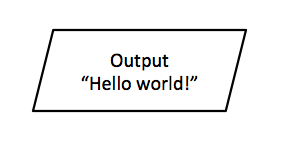
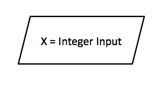
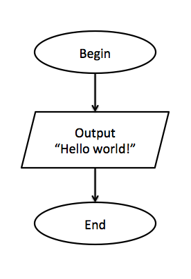
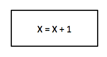
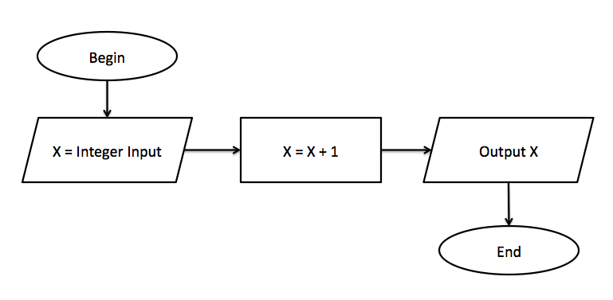
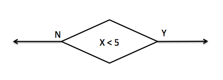
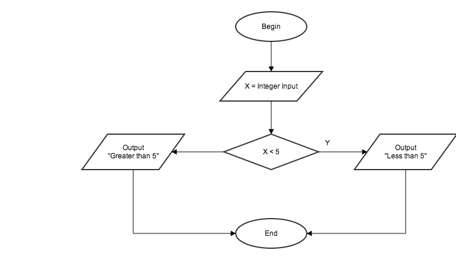

# Lesson 2: Decision Making

This lesson introduces flowcharts as a technique to design the logic of a program. Using the logic from those flowcharts, the lesson will guide you through implementing them using if-else statements.

## 2.1 Flowcharts
Forget about programming for a second and think about a car. When a group of engineers design a car, they have a high-level blueprint for the whole car. This blueprint refers to many other blueprints which capture the details of the smaller working parts such as the engine, the steering wheels, and so on.

For computer programs, their "blueprints" can be represented by flowcharts. Larger programs will have many flowcharts, and smaller programs will have fewer flowcharts. Flowcharts capture the ideas behind a program and how it executes.

> In reality, flowcharts aren't used as often as one might think. Seasoned programmer can form ideas in their heads and start coding. However, it is important to get into the habit of thinking in terms of how a program executes.

Let's suppose we want to design a program which will **have the user input an integer. If the number is higher than 10 then print the message "This number is larger than 10", otherwise let the user know if the number is odd or even.**

### 2.1.1 The beginning and The end
Every program has a beginning and an end – as do flowcharts. A complete flowchart often start with the word **"Begin"** inside an oval shape and ends with the word **"End"** inside another oval shape. To a program which does absolutely nothing, the flowchart would look like this:

Notice that an arrow is used to guide the direction of which the program is executing.

> There aren't hard-golden rules to the shape of different pieces inside a flowchart. However, there are conventions that most people follow. You might occasionally see flowcharts that start with circles instead of ovals. Same goes for the other shapes in the rest of this lesson.

### 2.1.2 Input and Output (I/O)
In the last lesson, you have written programs which output to the console window and take user input. Within a flowchart, **parallelograms** (or slanted rectangles) are often used to represent I/O operations.

Example of an output parallelogram:

Example of an input parallelogram:

Example of a program which prints out "Hello world!" to the console:

In this case, even though the program outputs to the console window, the flowchart didn't get into the specifics. Flowcharts capture ideas which can be implemented in different programming languages and systems. However, there are cases where it is necessary to get specific, such as differentiating between writing to the console window and writing to a file, in the same program.

### 2.1.3 Actions
Rectangles are used to describe actions which don't interact with users (not I/O). 

Example of an action which increments the value `X` by 1:

Inside a complete program:

### 2.1.4 Conditions
So far, all the programs we have written or designed just follow one straight path from the beginning to the end. Most programs are more complicated than that – they often have to decide if one action should be taken rather than another. To know which actions should be taken, a program would evaluate if some condition is satisfied. 

In the world of flowcharts, conditions are usually represented by a diamond shape, with two arrows pointing out. One arrow is annotated with a **"Yes"** or **"Y"**. The other arrow is annotated with a **"No"** or **"N"**. The program will go with the "Yes" path if the condition inside the diamond is satisfied. Respectively, it will go with the "No" path if the condition is not satisfied.

The following example represents a condition which the value of `X` is less than 5:

Inside the context of a program:

This program asks the user for an integer number. Based on whether the number is less than 5 or greater than 5, it will print out an appropriate message.